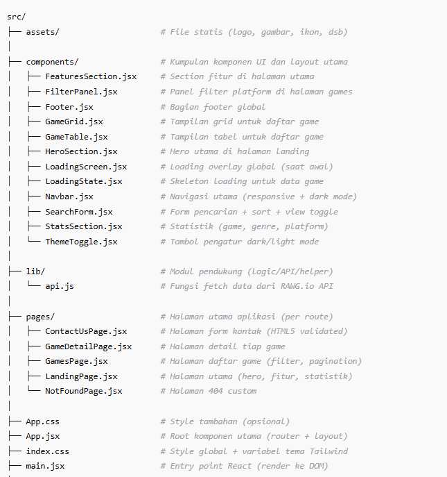

# Martino GameDB - UTS Studi Kasus Rawg io API Game

**Nama:** Martino Kelvin
**NIM:** 123140165
**Deployment:** [Lihat disini](https://martinogamedb.vercel.app/)

---

## Gambaran Proyek

Aplikasi ini merupakan **studi kasus UTS Pemrograman Web** yang menggunakan **RAWG.io Game API** untuk menampilkan data game, platform, rating, dan genre.

Seluruh fitur, halaman, dan komponen dibuat dengan  **React + Tailwind CSS** , dan sudah menyesuaikan rubrik penilaian **CPMK0501** dan **CPMK0502 . [API LINK](https://rawg.io/apidocs)**

---

## Fitur Utama

### Home(`src/pages/LandingPage.jsx`)

- Hero section dengan deskripsi dan tombol navigasi.
- Statistik platform, game, dan genre dari API.
- Section fitur (“Smart Search”, “Detailed Info”, dll).
- Desain responsif dan sudah mendukung dark/light mode.

### Games(`src/pages/GamesPage.jsx`)

- Fetch data dari **RAWG.io API** menggunakan fungsi `fetchGames`.
- Pencarian game berdasarkan nama, platform, dan urutan (rating atau tanggal rilis).
- Filter platform (PC, PlayStation, Xbox).
- Pagination (Next/Previous) dengan status halaman aktif.
- Dua tampilan: **grid view** dan  **table view** .
- Komponen modular: `SearchForm`, `FilterPanel`, `GameGrid`, `GameTable`.
- Skeleton/Loading state saat memuat data.

### Contact Us(`src/pages/ContactUsPage.jsx`)

- Form HTML5 validasi otomatis (`required`, `type`, `pattern`, dll).
- Input: nama, email, nomor telepon, subjek, pesan.
- Feedback visual saat input invalid.
- Tema mengikuti dark/light mode global.

### **Not Found (`src/pages/NotFoundPage.jsx`)**

- Halaman 404 khusus dengan tombol “Back to Home”.

---

## Kesesuaian Rubrik

### **CPMK0501: Form, Tabel, CSS**

- Form “Contact Us” memiliki >5 input berbeda dan validasi HTML5.
- Tabel di halaman “Games” menampilkan kolom: Judul, Rating, Platform, dan Genre.
- Menggunakan **Tailwind CSS** dengan variabel warna global dan sistem tema (dark/light).
- Desain sepenuhnya **responsif** dan mobile-friendly.

### **CPMK0502: HTML, JavaScript, React**

- Struktur HTML5 semantik (`header`, `main`, `section`, `footer`).
- Penggunaan  **modern JavaScript** : arrow function, async/await, destructuring, template literal.
- **React Hooks:** `useState`, `useEffect`, `useParams`, `useNavigate`.
- Komponen terpisah per fungsi (reusable & maintainable).
- Integrasi **API eksternal (RAWG.io)** dan rendering dinamis.
- State lokal untuk pagination, filter, dan theme.
- LocalStorage digunakan untuk menyimpan preferensi tema (dark/light).

---

## Struktur Direktori Inti



---

## Cara Menjalankan

### 1. Persiapan Lingkungan

Node.js >= 18 (npm atau bun)

### 2. Instal Dependensi

```bash
npm install
# atau
bun install
```

### 3. Menjalankan Mode Pengembangan

```bash
npm run dev
```

Buka URL yang muncul di terminal (umumnya `http://localhost:5173`)

### 4. Build Produksi (Opsional)

```bash
npm run build
npm run preview
```

---
